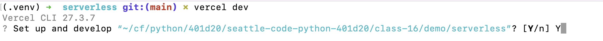
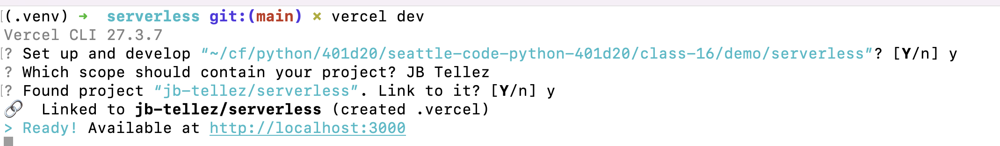

# Local Development with Vercel CLI

- Install [Vercel CLI](https://vercel.com/docs/concepts/deployments/overview#vercel-cli)
- from root of project run `vercel dev`
- Choose `Y` at 
- Choose your scope 
- Link your project 
- Run in browser locally 

Now you can see print statements. Also, it's just easier flow to run locally before pushing to Vercel. Deploying is pretty dang easy, but it's still 60 seconds vs. 10 and that adds up.
