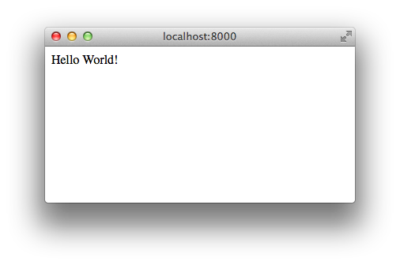
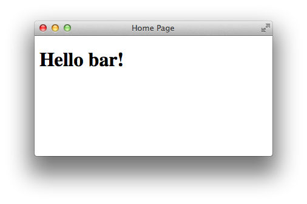
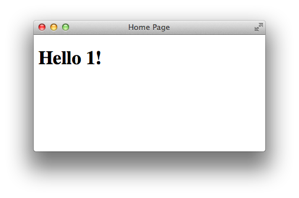
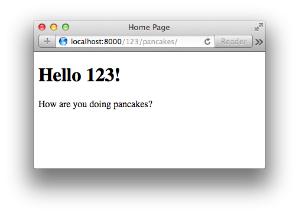
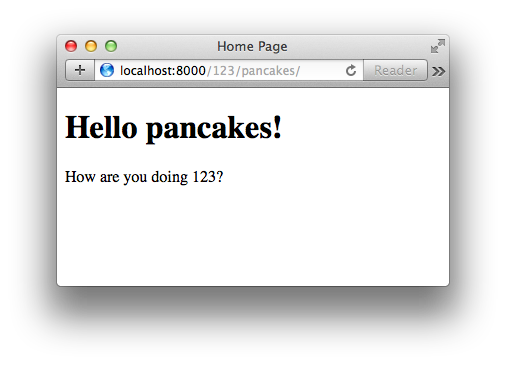
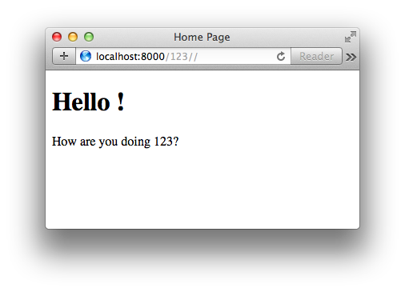
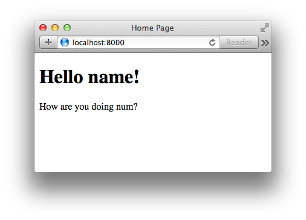

# Django URLs, Views and Templates

In this lecture we will investigate the basic outline of a Django request/response cycle.

* * *

## Introduction to Django Views

Views are very similar in Django as to how they are in Pyramid

  * They are callable items
  * They take a request as their first argument
  * Rather than returning a dictionary for some other renderer to deal with like Pyramid, Django returns a response object which includes the rendered template or text.

One other difference is that in Pyramid, when you get a request in and a view is called, if there are bits of the URL that got matched by the route that led to that particular view, where do those show up? They show up in the aspect of the request called the `matchdict`. That contains the pieces of the URL that got matched by the route on its way to matching up with the view.

In Django this happens in a different way. Elements from the request path that are matched by a pattern end up getting passed off to you as arguments to your view callable.

What does it mean to be callable in python? It means it’s an object that can be called. If it’s a class, it has a `__call__()` method, if it’s a function it automatically gets the `__call__()` method. Anything with those `()` parenthesis at the end is a callable in Python.

Django has moved largely to what is called “Class Based Views”. You define a class and that class has a bunch of methods, and those methods interact, and at the end they hand back a response object. You never actually define the call method because when you create a class based view, you inherit from one of Django’s built in base versions. At the root of the inheritance tree there is an implementation of a `__call__()` method that works in pretty much any situation.

We’ll talk for a few minutes here though going over function views, which is the old way Django used to work. The reason for doing this because we want to deconstruct how a view operates at its most generic level. Let’s think for a moment here how we will wire up a view in Django.

What’s the starting point for getting from an incoming request to a piece of code that will answer that request? Where did we begin in Pyramid? We began with a route. A route is the path that a request takes to a view. In Django what do we call routes? URLs. We’ve seen in our Django project in our site directory our `urls.py` file. We set up a static URL there to point to our media directory.

Django creates these things called `urlpatterns`. These are basically just lists of calls to the `path` function. `path()` comes from `django.urls` and it is responsible for wiring together 2 things:

  1. The pattern that is being used to match an incoming request.
  2. The view that will be pointed at.

We don’t have to point only to views, we can also point at other url confs. Let’s start by pointing at a view though. Let’s start with a new `url`, and add a regular expression. We should always use a raw string when doing regex to avoid having to escape escapes.

  * `path('', views.home_view, name='homepage')`
    * This regex matches only a home directory “/”. The “^” and “$” starting and ending the route string signify that. (See regex documentation for more info.)
    * The second argument is a callable item that is the thing that gets executed when the route gets matched. `lending_library.views.home_view` will look in our current directory for a package called views, and look inside there for a `home_view()` function.
    * A third argument to `path()` is an optional argument called `name` that provides a handle that we can use to call `reverse` in Django, and build these urls back. Remember in Pyramid that we had on the request object a function called [`route_url()`](http://docs.pylonsproject.org/projects/pyramid/en/latest/api/request.html#pyramid.request.Request.route_url).
    * It took the name of a route, and optionally some arguments that matched up with the placeholders in that route.
    * It handed back a rendered URL that would go to that route.
    * Django has the same system, and it’s called `reverse`, and it allows you to build URLs given the name of a view and some arguments that would match up with the placeholders in that URL. Right now we don’t have any arguments, so we could just say `reverse.homepage` and we’d get back the url for the homepage view.

We’ve said now that we have a file called `views` and that it contains a function called `home_view()`. Does that exist at the moment? No. We also should have a linter error showing on our `views` part of `lending_library.views.home_view`. That’s telling us that we don’t have `views` imported as a symbol in our current namespace. Django has two ways of dealing with this.

  * We can either `import views`
  * `from lending_library import views` to specifically pull `views` from a particular app
  * or we can cast `'lending_library.views.home_view'` as a string. When we do this, Django will attempt to perform an import statement. As long as `views` is actually importable, this will work.
    * This is a nice way to avoid circular import problems. `urls.py` can be a dangerous place because you will import many view files here. Those views will import models. Those models may import something else that points to `urls.py`. It’s easy to accidentally build circular import problems. If you pass in the imports as strings, this problem can be avoided.

_lending\_library/lending\_library/urls.py_


```python
...
from django.urls import include, path
from django.contrib import admin

urlpatterns = [
    path('admin/', include(admin.site.urls)),
    path('', 'lending_library.views.home_view', name='homepage')
]
...
```
I prefer to import at the top, so I’ll use that from here on. Our `urls.py` will look like this:
```python
...
from django.urls import include, url
from django.contrib import admin
from lending_library.views import home_view

urlpatterns = [
    path('admin/', include(admin.site.urls)),
    path('', home_view, name='homepage')
]
...
```
What does our view return at the moment?
```python
def home_view(request):
    """Home view callable, for the home page."""
    return "Hello World!"
```

A simple string. That’s not what Django is looking for. Remember, Django views must return something that can be used as a response. It needs headers and all the other things that make a proper HTTP response. So what Django provides us with is the [`HttpResponse`](https://docs.djangoproject.com/en/2.0/ref/request-response/#httpresponse-objects) object. Let’s add that to our view so that our function can use it:

_lending_library/lending_library/views.py_

```python
from django.http import HttpResponse


def home_view(request):
    """Home view callable, for the home page."""
    return HttpResponse("Hello World!")
```


Now when the request comes in, we’ll build a response with this “Hello World!” string in it. We should be able to go and see our app return that in our browser.

Let’s start up our testing server and browse to `http://localhost:8000/`:



This is the basic shape that a Django view takes:

  * A request comes in
  * You do some stuff with it
  * And then you return something that functions as a response.

You can build the response manually like our current `home_view()` function. You can also render out templates.

### [Django Templating Engine](https://docs.djangoproject.com/en/2.0/topics/templates/)

Loading a template is something we want to do. We can create a template, or we can load one up from somewhere else. Let’s find where we can do that by inspecting Django in the shell:

`$ python manage.py shell`

    In [1]: from django import template
    In [2]: dir(template)
    Out[2]:
    ['Context',
     'ContextPopException',
    ...
     'engines',
     'loader',
    ]


We want to further inspect the `loader` object

    In [3]: from django.template import loader

    In [4]: dir(loader)
    Out[4]:
    ['DeprecationInstanceCheck',
     'LoaderOrigin',
     'Origin',
     'RemovedInDjango20Warning',
    ...
     'engines',
     'get_template',
    ]


Of the many classes and functions belonging to the `loader` object, `get_template` is what we’re looking for. Let’s use that in our `views.py`:

_lending_library/lending_library/views.py_

```python
from django.http import HttpResponse
from django.template import loader


def home_view(request):
    """Home view callable, for the home page."""
    template = loader.get_template('lending_library/home.html')
    return HttpResponse("Hello World!")
```

This gets us to the idea of template loaders and where Django looks for templates. By default, Django comes with a system that allows it to look inside any installed app for a directory that’s called `templates`. And it will start looking for templates in that directory. If we want to have templates within the `lending_library` configuration root, we need to add `lending_library` to the list of `INSTALLED_APPS`.


```python
    INSTALLED_APPS = [
        'django.contrib.admin',
        'django.contrib.auth',
        'django.contrib.contenttypes',
        'django.contrib.sessions',
        'django.contrib.messages',
        'django.contrib.staticfiles',
        'patron_profile',
        'lending_library' # <-- add this!
    ]
```


So, for example:

_lending_library/lending_library/templates/lending_library/home.html_


```html
<!DOCTYPE html>
<html>
<head>
  <title>Home Page></title>
</head>
<body>
  <h1> Hello World!</h1>
</body>
</html>
```

We now have an html file that lives in a `templates` directory inside one of our apps. This is how Django works by default. If we run our server, we should find that when the request comes in, our `home_view` function receives it and tries to load the template.

We’ll modify our `views.py` file to handle templates now, and drop a breakpoint in there so we can inspect some things:

_lending_library/lending_library/views.py_


```python
from django.http import HttpResponse
from django.template import loader


def home_view(request):
    """Home view callable, for the home page."""
    import pdb; pdb.set_trace()
    template = loader.get_template('lending_library/home.html')
    response_body = template.render()
    return HttpResponse(response_body)
```


When we attempt to browse to our homepage again, we’ll drop into our debugger:

    -> template = loader.get_template('lending_library/home.html')
    (Pdb) n
    > .../lending_library/lending_library/views.py(8)home_view()
    -> response_body = template.render()
    (Pdb) template
    <django.template.backends.django.Template object at 0x11252ed50>

So we have a template object. Let’s inspect it:

    (Pdb) dir(template)
    ['__class__', '__delattr__', '__dict__', '__dir__', '__doc__', '__eq__', '__format__', '__ge__', '__getattribute__', '__gt__', '__hash__', '__init__', '__init_subclass__', '__le__', '__lt__', '__module__', '__ne__', '__new__', '__reduce__', '__reduce_ex__', '__repr__', '__setattr__', '__sizeof__', '__str__', '__subclasshook__', '__weakref__', 'backend', 'origin', 'render', 'template']

You can see that `render` is one the the `template` methods. What happens next?

    (Pdb) l
      3
      4
      5     def home_view(request):
      6         """Home view callable, for the home page."""
      7         import pdb; pdb.set_trace()
      8         template = loader.get_template('lending_library/home.html')
      9  ->     response_body = template.render()
      10         return HttpResponse(response_body)
    [EOF]
    (Pdb) n
    > .../lending_library/lending_library/views.py(10)home_view()
    -> return HttpResponse(response_body)
    (Pdb) response_body
    u'<!DOCTYPE html>\n<html>\n<head>\n  <title>Home Page></title>\n</head>\n<body>\n  <h1> Hello World!</h1>\n</body>\n</html>\n'
    (Pdb)


So we get a string that’s been rendered out into HTML.

The `render()` method is much like rendering in python.

`response_body = template.render({'foo': 'bar'})`


```html
<body>
  <h1> Hello {{ foo }}!</h1>
</body>
```




Django’s templating language looks just like Jinja2, and in fact in later versions of Django (>=1.8), you can specify what templating engine you want to use, and it can be Jinja2.

When using Django, you are encouraged to try and use Django’s templating language because it tries to keep as much processing of values away from the templates as possible, and instead has processing done in python.

So this kind of a pattern here:

  1. where we take in a request
  2. we load up a template
  3. we render that template and pass some kind of a context to it
  4. we use the rendered body of that and hand it back as a result of our call

This is a very common thing in Django. At the root level, this is always the pattern.

We’ll talk for a moment here about ways this pattern might change. Let’s add another url to our `urlpatterns`, and a new `test_view`.

_lending_library/lending_library/urls.py_


```python
from lending_library.views import home_view, test_view
...
urlpatterns = [
    path('admin/', include(admin.site.urls)),
    path('', home_view, name='homepage'),
    path('<int:id>/', test_view, name='testme'),
]
...
```


_lending_library/lending_library/views.py_


```python
...
def test_view(request, foo):
    """Test view callable, for the testing URL patterns."""
    template = loader.get_template('lending_library/home.html')
    response_body = template.render({'foo': foo})
    return HttpResponse(response_body)
```

It’s important to note that when changing around URLs, it’s a good idea to restart your server because they are often cached.

So what does our new url match? `path('<int:id>/', ...` One or more numeric digits. If we go to our browser now and navigate to this url: `http://localhost:8000/1/`, we will see that `1` rendered in our template:



You can see that any number put in that url end up as keyword arguments. If they don’t have a name to them, they end up as positional arguments. If we change up our urls to accept two positional arguments:

`path('<int:id>/', test_view, name='testme'),`

And change our views so that `test_view` accepts `foo` and `bar`:

_lending_library/lending_library/views.py_


```python
...
def test_view(request, foo, bar):
    """Test view callable, for the testing URL patterns."""
    template = loader.get_template('lending_library/home.html')
    response_body = template.render({'foo': foo}, {'bar': bar})
    return HttpResponse(response_body)
```

And accept our new variable `bar` into our template:

_lending_library/lending_library/templates/lending_library/home.html_


```jinja
<!DOCTYPE html>
<html>
<head>
  <title>Home Page</title>
</head>
<body>
  <h1>Hello {{ foo }}!</h1>
  <p>How are you doing {{ bar }}?</p>
</body>
</html>
```

Now our page renders like this:



If we decide to change our minds and use keyword arguments instead of positional arguments, we can do that:

_lending_library/lending_library/urls.py_


```python
...
urlpatterns = [
    path('admin/', include(admin.site.urls)),
    path('', home_view, name='homepage'),
    path('<int:id>/', test_view, name='testme'),
]
...
```

_lending_library/lending_library/views.py_


```python
...
def test_view(request, num=0, name='balloons'):
    """Test view callable, for the testing URL patterns."""
    template = loader.get_template('lending_library/home.html')
    response_body = template.render({'foo': num, 'bar': name})
    return HttpResponse(response_body)
```

So now we can change around the order in which the arguments come in because they are keywords:

`def test_view(request, name='balloons', num=0):`

`response_body = template.render({'foo': name, 'bar': num})`



This is the relationship between the urls and the patterns you set up for the urls, and the call signatures that you write for views. Placeholders will be passed as arguments to your views. This is very different from the Pyramid way of doing things. Those arguments can be keyword arguments if the placeholders you create for them are marked with the `(<type:...>)` syntax. This is standard python syntax.

_Question: So since we’re passing defaults into your keyword arguments, if we don’t pass them into the url, will it use the defaults?_

Let’s try that. First we’ll change our url matching pattern to accept 0 or more characters in the path:


```python
    path('<int:id>', test_view, name='testme'),
```



So it didn’t pick up our default value. The fact that we provided them in our view is a bit of a red herring. If the url is going to match, some value will be there and will be passed it. But this is how you make optional keyword arguments - by providing them with a default value.

It is possible to make Django url patterns that have fully optional chunks in them that might or might not be present. It’s not very easy to do. It takes some complex regex patterns. It may not be the best way of doing things as well. Sometimes it’s better to just make more than one url pattern point to the same view. We can make a 2nd pattern here that only contains the `<num>` matching part, and then our default optional keyword would actually pass it’s value through.

You must put a default value there in order for it to be a keyword parameter. However, unless you make a special complex matching pattern or a second url that doesn’t use a keyword and points to the same view, it will not use the default parameter.

### [Django Shortcuts](https://docs.djangoproject.com/en/2.0/topics/http/shortcuts/)

This idea of loading a template, rendering a template, and handing back a response is so completely common, that Django has created a few shortcuts that mean exactly the same thing. The shortcuts are called [`render`](https://docs.djangoproject.com/en/2.0/topics/http/shortcuts/#render) and [`render_to_response`](https://docs.djangoproject.com/en/2.0/topics/http/shortcuts/#render-to-response).

`render` takes a `request` and `template_name` as required arguments. There are a few optional arguments as well.

Let’s explore this for a moment. We need to re-write our `views.py`:

_lending_library/lending_library/views.py_


```python
# from django.http import HttpResponse <-- replace this line
# from django.template import loader  <-- and this line
from django.shortcuts import render # <-- with this line


def home_view(request):
    """Home view callable, for the home page."""
    context = {'foo': 'name', 'bar': 'num'}
    return render(request, 'lending_library/home.html', context=context)
...
```

So our shortcut `render` takes the `request` as an argument, the template (‘home.html’), and our hard-coded context.

Let’s go back to our homepage and see what it looks like now:

`http://localhost:8000/`



We can do the same thing to our `test_view`:

_lending_library/lending_library/views.py_


```python
...
def test_view(request, num=0, name='baloons'):
    """Test view callable, for the testing URL patterns."""
    context = {'num': num, 'name': name}
    return render(request, 'lending_library/home.html', context=context)
```

We need to also change our `home.html` to work with our `test_view`:

_lending_library/lending_library/templates/lending_library/home.html_


```jinja
<!DOCTYPE html>
<html>
<head>
  <title>Home Page</title>
</head>
<body>
  <h1>Hello {{ name }}!</h1>
  <p>How are you doing {{ num }}?</p>
</body>
</html>
```

And our `home_view` needs adjusting now too:

_lending_library/lending_library/views.py_


```python
def home_view(request):
    """Home view callable, for the home page."""
    context = {'name': 'name', 'num': 'num'}
    return render(request, 'lending_library/home.html', context=context)
```

And we’re back to our “Hello Pancakes”


### [`render_to_response`](https://docs.djangoproject.com/en/2.0/topics/http/shortcuts/#render-to-response)

Another thing we can do is `render_to_response`. There is a difference between these two. From the docs: “This function preceded the introduction of `render()` and works similarly except that it doesn’t make the request available in the response. It’s not recommended and is likely to be deprecated in the future.”

There’s really not a good reason to use `render_to_response` unless you have a very special use case. You may run into `render_to_response` in legacy code. We will be using `render()` instead of `render_to_response()`.

