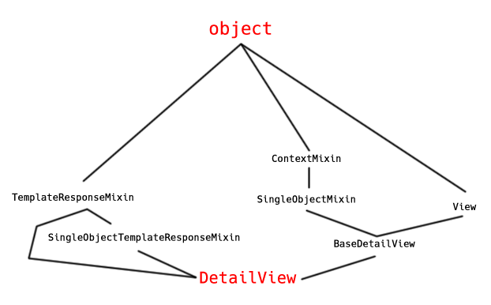
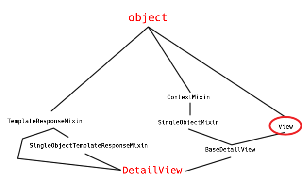
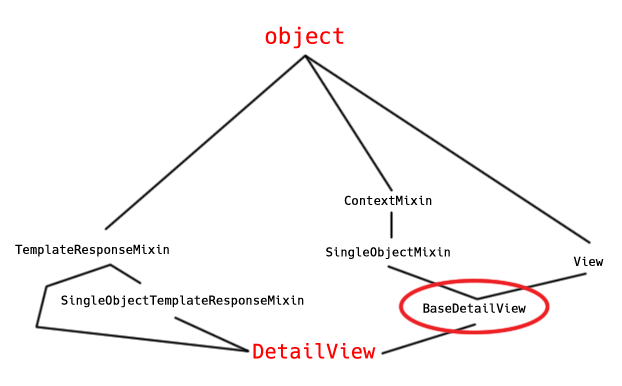
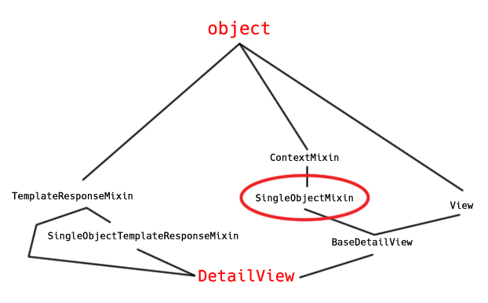
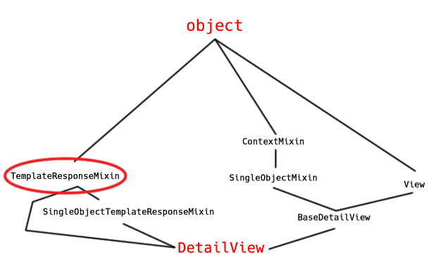

# Deep Dive into Class-Based Views

## The `DetailView`

Let’s take a deep dive into the inheritance structure of the `DetailView` and
a walk through a single GET request.

Class-based views (CBVs) use class inheritance. They also use the “mixin”
pattern.

  * You create classes with specific, related functionality
  * You can include that class as a parent of another classes

In your terminal, navigate to the directory containing the `django_lender`,
then to `ENV/lib/python3.6/site-packages/`

You can see in there some of the installed packages required to make Django
work.

Now use your editor to open the `django` directory in the `site-packages`
directory.

We’re going to pick one of our generic views and inspect it. We’ll start with
the [`DetailView`](https://docs.djangoproject.com/en/2.0/ref/class-based-views/generic-display/#detailview)

It’s worth our time to learn how this class is put together and to understand
the Method Flowchart so that we can spelunk down through these methods and see
what we may want to use, as well as what we may want to override.

Open up in your editor `django/views/generic/`. When we open a view such as
the `DetailView`, we use `from django.views.generic import DetailView`. What
does that mean in terms of the structure of this package?

Where will we look for the `DetailView`?

The generic directory has a file in it called `__init__.py`. This file creates
an API for Django’s `generic` package. It imports into its own namespace a
whole bunch of modules that are inside the `generic` package, that would on
their own be spread across various files.

It uses a trope called the special `__all__` attribute. This attribute says,
if you would like to import from `django.views.generic`, here are all of the
symbols available to you:

_...$VIRTUAL_ENV/lib/python3.6/site-packages/django/views/generic/\_\_init\_\_.py_


```python
...
 __all__ = [
    'View', 'TemplateView', 'RedirectView', 'ArchiveIndexView',
    'YearArchiveView', 'MonthArchiveView', 'WeekArchiveView', 'DayArchiveView',
    'TodayArchiveView', 'DateDetailView', 'DetailView', 'FormView',
    'CreateView', 'UpdateView', 'DeleteView', 'ListView', 'GenericViewError',
]
...
```

If you want to learn where something is defined, you can come here to
`__init__.py` and look for the import statement:

`from django.views.generic.detail import DetailView`

Let’s open `django/views/generic/detail.py` now. Find the `DetailView` class
definition:

_...$VIRTUAL_ENV/lib/python3.6/site-packages/django/views/generic/detail.py_


```python
 class DetailView(SingleObjectTemplateResponseMixin, BaseDetailView):
    """
    Render a "detail" view of an object.

    By default this is a model instance looked up from `self.queryset`, but the
    view will support display of *any* object by overriding `self.get_object()`.
    """
```

We see here that `DetailView` doesn’t define a single thing itself.

`DetailView` inherits from `SingleObjectTemplateResponseMixin` and
`BaseDetailView`. Scrolling up (or text search), we can inspect the
`SingleObjectTemplateResponseMixin`. It inherits from `TemplateResponseMixin`.

Now we’ll look at `BaseDetailView`, and it inherits from a couple of things:

  * `SingleObjectMixin`
  * `View`

`SingleObjectMixin` inherits from `ContextMixin`. `ContextMixin` comes from
this import: `from django.views.generic.base import ContextMixin,
TemplateResponseMixin, View`

We need to go deeper. DjangoCeption.

Open `base.py` from the `generic` directory.

_...$VIRTUAL_ENV/lib/python3.6/site-packages/django/views/generic/base.py_

So we find that `ContextMixin`, `TemplateResponseMixin`, and `View` all
inherit from `object` here, and that’s the root of our inheritance tree. This
is multiple inheritance.



So let’s go back to our `View` class, and imagine that we have made a `GET`
request to the `/library/books/1` route. We would expect this to show us a
book, with an id of 1. (`GET http://oursite.com/library/books/1 HTTP/1.1`)

Let’s inspect `View`:

_...$VIRTUAL_ENV/lib/python3.6/site-packages/django/views/generic/base.py_


```python
...
 class View(object):
    """
    Intentionally simple parent class for all views. Only implements
    dispatch-by-method and simple sanity checking.
    """

    http_method_names = ['get', 'post', 'put', 'patch', 'delete', 'head', 'options', 'trace']

...
    @classonlymethod
    def as_view(cls, **initkwargs):
        """
        Main entry point for a request-response process.
        """
        for key in initkwargs:
            if key in cls.http_method_names:
                raise TypeError("You tried to pass in the %s method name as a "
                                "keyword argument to %s(). Don't do that."
                                % (key, cls.__name__))
            if not hasattr(cls, key):
                raise TypeError("%s() received an invalid keyword %r. as_view "
                                "only accepts arguments that are already "
                                "attributes of the class." % (cls.__name__, key))
...
```

Let’s walk through this code.

  * We define a `@classonlymethod`. This means it is probably only available on the class and not on an instance. Is it a Django specific construct? Yes, it seems so.
  * The `as_view` method iterates over an object called `initkwargs`. For each key in the `initkwargs`, it checks whether the key is in the `cls.http_method_names`. If it is, Django raises a `TypeError` with a helpful message. If not, it moves on to check whether the key is an attribute of the class. If it is not, a `TypeError` is raised with a helpful message.

Think about yesterday where we passed arguments to `as_view()`, something like
`template_name="lending_library/home.html"`. If the keyword passed to this
class is available, it will accept it. If not it will reject it with a
message. In other words, any attribute of this class can be overridden in the
call to `as_view()`.

Next we have a `view` method. It accepts `request, *args, **kwargs)`. It binds
`self` to the class attributes `**initkwargs`. If `self` `hasattr('get')` and
does not `hasattr('head')`, we will bind `self.head = self.get`.

  * Normally what `head` is suppose do to is return headers of the response without returning a response.

The important part is next:

  * It binds `self.request = request`
  * It binds `self.args = args`
  * It binds `self.kwargs = kwargs`

What kind of a function is this?


```python
def view(request, *args, **kwargs):
```

It’s a function based view - much like what we built last Tuesday. A function
based view is a function that takes a request as the first argument, and may
or may not have positional or keyword arguments that are passed to it as a
result of the URL pattern that it matches. This is the most generic possible
call signature to represent any possible view. It will accept any positional
arguments and any keyword arguments, and it will accept `request` as the first
positional argument. This is what is returned when the `as_view()` method is
called. This means we are creating, as a result of calling `as_view()`, a
function that has `self` baked into it, that will end up being called when
that particular URL is matched.

What we’re doing is creating a function that wraps around an instance of our
class, and then executes `dispatch()` on that instance.

Remember what Django does:

  * It takes a URL from the initial HTTP request
  * It looks at the URL and tries to match it to one of the patterns defined in the `urlpatterns` list in `lending_library/lending_library/urls.py`.
  * When it does, it then extracts from the URL the `*args` and `**kwargs` that are part of the URL, as specified by the `?P` pattern in the route declaration.
  * It takes the request, the `*args`, and the `**kwargs` and passes those off to a call of the function that it has been bound to in your url configuration. This may be a function-based view that takes these directly or the `as_view()` method of a class-based view.
    * `def view(request, *args, **kwargs):` is that function for a class based view.

What this means is that the first method that every single class-based view
that inherits from `View` will see is the `dispatch()` method.

Let’s look at `dispatch()` now, and see what it does.

## [`CBV dispatch()`](https://docs.djangoproject.com/en/2.0/ref/class-based-views/base/#django.views.generic.base.View.dispatch)

_...$VIRTUAL_ENV/lib/python3.6/site-packages/django/views/generic/base.py_


```python
 class View(object):
...
def dispatch(self, request, *args, **kwargs):
    # Try to dispatch to the right method; if a method doesn't exist,
    # defer to the error handler. Also defer to the error handler if the
    # request method isn't on the approved list.
    if request.method.lower() in self.http_method_names:
        handler = getattr(self, request.method.lower(), self.http_method_not_allowed)
    else:
        handler = self.http_method_not_allowed
    return handler(request, *args, **kwargs)
```

We know the first stop on our trip will be the `View` class, and it is there
that we will call `dispatch()`.



  * Conditional check to see if the `request.method` is in the `http_method_names`.
    * If it’s not, it sets `handler = self.http_method_not_allowed` and then calls that method. Then it does some logging.
    * If it is, we set handler to either the method that matches the request, or `http_method_not_allowed` if that particular method is not allowed.

In our case here, what is our HTTP method? `GET`.

What’s the next call that will happen here then? We’ll call the `self.get()`
method of our `DetailView` class.

Is there a `get()` method on our `View` class? It doesn’t look like it. It
could come from any of our classes that `DetailView` inherits from!

If we look hard enough, we’ll find it in `BaseDetailView`. So, stop number 2
in our trip is the `get()` method of class `BaseDetailView`:



_django/views/generic/detail.py_


```python
 class BaseDetailView(SingleObjectMixin, View):
    """
    A base view for displaying a single object
    """
    def get(self, request, *args, **kwargs):
        self.object = self.get_object()
        context = self.get_context_data(object=self.object)
        return self.render_to_response(context)
```

Let’s walk through this.

  * `get()` accepts the `request`, `*args`, `**kwargs`.
  * It binds `self.object` to `self.get_object()`
  * It binds `context` to `self.get_context_data(object=self.object)`
  * It returns `self.render_to_response(context)`

Mostly we just call a bunch of other methods and then return the `context`.

Let’s search for `get_object()` now and see what it does. It’s found in the
`SingleObjectMixin` class, so that’s the next stop on our journey.



_django/views/generic/detail.py_


```python
 class SingleObjectMixin(ContextMixin):
    """
    Provides the ability to retrieve a single object for further manipulation.
    """
    model = None
    queryset = None
    slug_field = 'slug'
    context_object_name = None
    slug_url_kwarg = 'slug'
    pk_url_kwarg = 'pk'
    query_pk_and_slug = False

    def get_object(self, queryset=None):
        """
        Returns the object the view is displaying.

        By default this requires `self.queryset` and a `pk` or `slug` argument
        in the URLconf, but subclasses can override this to return any object.
        """
        # Use a custom queryset if provided; this is required for subclasses
        # like DateDetailView
        if queryset is None:
            queryset = self.get_queryset()

        # Next, try looking up by primary key.
        pk = self.kwargs.get(self.pk_url_kwarg, None)
        slug = self.kwargs.get(self.slug_url_kwarg, None)
        if pk is not None:
            queryset = queryset.filter(pk=pk)

        # Next, try looking up by slug.
        if slug is not None and (pk is None or self.query_pk_and_slug):
            slug_field = self.get_slug_field()
            queryset = queryset.filter(**{slug_field: slug})

        # If none of those are defined, it's an error.
        if pk is None and slug is None:
            raise AttributeError("Generic detail view %s must be called with "
                                 "either an object pk or a slug."
                                 % self.__class__.__name__)

        try:
            # Get the single item from the filtered queryset
            obj = queryset.get()
        except queryset.model.DoesNotExist:
            raise Http404(_("No %(verbose_name)s found matching the query") %
                          {'verbose_name': queryset.model._meta.verbose_name})
        return obj
```

What does it do? What are the attributes that are available here on this
class?

  * There’s a `model` attribute. We can probably guess what it does.
  * There’s a `queryset` attribute. We can probably guess what it does. If we passed in `model.objects` that would be a `queryset`.
  * There’s a `slug` field
  * There’s a `context_object_name` field
  * a `slug_url_kwarg`
  * a `pk_url_kwarg`
  * a `query_pk_and_slug`

What do these attributes mean? What can we do with them? Remember our
`as_view()` method? Anything that is an attribute of the `View` class can be
passed in as a keyword argument to the `as_view()` call. All of these
attributes are customization points to our `DetailView`.

## The [`get_object`](https://docs.djangoproject.com/en/2.0/ref/class-based-views/mixins-single-object/#django.views.generic.detail.SingleObjectMixin.get_object) method

What does `get_object()` do? (Student reads through code):

  * If we don’t have a `queryset`, then we set `queryset` to the value of `self.get_queryset()`
    * Let’s hold of for a minute exploring this
  * We set our `pk` (primary key) to what is in `self.kwargs`
    * We got this from our `dispatch()` method where we set up our `view` function, and on that we built an instance of `self` and we set `self.request, self.args, self.kwargs` to be the arguments and keyword arguments that were passed into that view function. So this is whatever kwargs came in from our URL.
    * So we set `pk` to the `pk_url_kwarg` value, or `None`
  * We do the same for `slug`

So our `slug_url_kwarg` and `pk_url_kwarg` are being used as a key for a
dictionary lookup in the kwargs that got passed to us as part of our `View`
call.

If we use a primary key in our URL, then magically when our `view()` method
gets called, that `pk` keyword argument will be present in `self.kwargs`. This
means when we try to get `pk` from `self.kwargs`, we will get the value
present there which in our case will be 1. So our `pk` will not be `None`.

What do we do with it if it’s not `None`? We take the `queryset` that we have
built by calling `self.get_queryset`, and we filter that `queryset` to show us
only those objects that have our `pk`.

If this works, then great! Otherwise we can try and do the same thing with the
`slug`, where we’re filtering on the `slug`.

Otherwise we raise an `AttributeError` that states that we need either a `pk`
or `slug`.

What happens here?:


```python
try:
    # Get the single item from the filtered queryset
    obj = queryset.get()
except queryset.model.DoesNotExist:
    raise Http404(_("No %(verbose_name)s found matching the query") %
                  {'verbose_name': queryset.model._meta.verbose_name})
return obj
```

  * We try the `.get()` method on our `queryset`
  * If that results in an exception of `queryset.model.DoesNotExist` then we raise a 404 error.
  * Otherwise we return whatever `obj` is.

So let’s look at this in the context of a site that wants to show photos.
Maybe you want to sort out into photos that are published and ones that are
not. This `get_queryset()` method could allow you to provide a view here that
only returns published photos.

Let’s look now for `get_queryset()`. It’s right below:


```python
def get_queryset(self):
    """
    Return the `QuerySet` that will be used to look up the object.

    Note that this method is called by the default implementation of
    `get_object` and may not be called if `get_object` is overridden.
    """
    if self.queryset is None:
        if self.model:
            return self.model._default_manager.all()
        else:
            raise ImproperlyConfigured(
                "%(cls)s is missing a QuerySet. Define "
                "%(cls)s.model, %(cls)s.queryset, or override "
                "%(cls)s.get_queryset()." % {
                    'cls': self.__class__.__name__
                }
            )
    return self.queryset.all()
```

  * If there is not a `queryset`, then go to the model and get the `_default_manager` and call the `all()` method on it.
  * Otherwise if you don’t have a model or `queryset` then an `ImproperlyConfigured` error is thrown that says “we have no idea what you are looking for”.

Remember, `model` and `queryset` are available to you as arguments. So, you
can specify the model, and then override the `get_queryset()` method to call
`super().get_queryset()` that would hand you back all objects, then you can
filter that `queryset` on only those that are published. This is how our
custom subclasses of `models.ModelManager` work!

Inside that set of filtered objects, we could look for the one that has the
given primary key, and give that back or raise 404. Now we’re getting a sense
of the path we take to get through a call.

## A Little More About `get_context_data()`

Going back to our `BaseDetailView`, the next thing it does is call
`get_context_data()`:

_django/views/generic/detail.py_


```python
...
 class SingleObjectMixin(ContextMixin):
...
    def get_context_object_name(self, obj):
        """
        Get the name to use for the object.
        """
        if self.context_object_name:
            return self.context_object_name
        elif isinstance(obj, models.Model):
            return obj._meta.model_name
        else:
            return None

    def get_context_data(self, **kwargs):
        """
        Insert the single object into the context dict.
        """
        context = {}
        if self.object:
            context['object'] = self.object
            context_object_name = self.get_context_object_name(self.object)
            if context_object_name:
                context[context_object_name] = self.object
        context.update(kwargs)
        return super(SingleObjectMixin, self).get_context_data(**context)
...
```

  * First we set our context to an empty dictionary.
  * If `self.object` exists:
    * Set `context['object'] = self.object`
    * Set `context_object_name` to the return of `get_context_object_name(self.object)`
      * If we have a `context_object_name`, return it
      * Else if our object is an instance of a `Model`, return the name of the model.
      * Else return `None`

Given no customization to any of our attributes, which happen to include
`context_object_name`, what keys in our context dictionary will point at the
object that we are looking for? We have `get_context_data()`. It’s already set
up one name for it. It’s not setting up a second name to look at.

If we want to refer to our object in a template, how do we refer to it? In
this case `get_context_object_name` will get the name of the Model (like Photo
or Book). If we wanted to call it `Potato`, then when we call `as_view()` in
our URLconf, we could pass the `context_object_name` keyword argument, and
point it at `Potato`. Then `Potato` would be available to us in our template.

So, we’ve gotten the `context_object_name`, and now we are doing what?
`context.update(kwargs)` to add our `kwargs` to the `context`. Lastly we call
`super` for the `.get_context_data(**context)`.

_django/views/generic/base.py_


```python
 class ContextMixin(object):
    """
    A default context mixin that passes the keyword arguments received by
    get_context_data as the template context.
    """

    def get_context_data(self, **kwargs):
        if 'view' not in kwargs:
            kwargs['view'] = self
        return kwargs
```

So all this does is take the kwargs and says: if we don’t have the `view`
object itself in our `kwargs`, then go ahead and add it and return `kwargs`.
This ensures that the actual view itself is included as part of the context
that gets passed to our template. What that means is that in the context of
your template you can refer to your view class that is powering that template.

## The Next Step in the Process

So there are are a couple of other classes in our inheritance path that came
from various places in this hierarchy. You can see that it can become
complicated. Let’s go back to our `BaseDetailView` and look at the `get()`
method again.

What’s the last thing that happens after we’ve gotten our context data?

`return self.render_to_response(context)`

We call the `render_to_response` method and pass the `context`. So let’s look
at `render_to_response`

## `render_to_response`



_django/views/generic/base.py_


```python
...
 class TemplateResponseMixin(object):
    """
    A mixin that can be used to render a template.
    """
    template_name = None
    template_engine = None
    response_class = TemplateResponse
    content_type = None

    def render_to_response(self, context, **response_kwargs):
        """
        Returns a response, using the `response_class` for this
        view, with a template rendered with the given context.

        If any keyword arguments are provided, they will be
        passed to the constructor of the response class.
        """
        response_kwargs.setdefault('content_type', self.content_type)
        return self.response_class(
            request=self.request,
            template=self.get_template_names(),
            context=context,
            using=self.template_engine,
            **response_kwargs
        )
...
```

So our `render_to_response()` method gets called with a context and optionally
some keyword arguments. Does our current call pass any keyword arguments
besides context? No. What does this method do?

  * `response_kwargs` are set to `{"content_type": self.content_type}`
  * We return the value of `self.response_class()`
    * Passing in `request`
    * `template`
    * `context`
    * `using` (which template engine)
    * any `**response_kwargs`

`get_template_names()` returns a list of templates to be used for the request.

Does `SingleObjectTemplateResponseMixin` have a `get_template_names()` method
too? Hell yes it does.

_django/views/generic/detail.py_


```python
 class SingleObjectTemplateResponseMixin(TemplateResponseMixin):
    template_name_field = None
    template_name_suffix = '_detail'

    def get_template_names(self):
        """
        Return a list of template names to be used for the request. May not be
        called if render_to_response is overridden. Returns the following list:

        * the value of ``template_name`` on the view (if provided)
        * the contents of the ``template_name_field`` field on the
          object instance that the view is operating upon (if available)
        * ``<app_label>/<model_name><template_name_suffix>.html``
        """
        try:
            names = super(SingleObjectTemplateResponseMixin, self).get_template_names()
        except ImproperlyConfigured:
            # If template_name isn't specified, it's not a problem --
            # we just start with an empty list.
            names = []

            # If self.template_name_field is set, grab the value of the field
            # of that name from the object; this is the most specific template
            # name, if given.
            if self.object and self.template_name_field:
                name = getattr(self.object, self.template_name_field, None)
                if name:
                    names.insert(0, name)

            # The least-specific option is the default <app>/<model>_detail.html;
            # only use this if the object in question is a model.
            if isinstance(self.object, models.Model):
                names.append("%s/%s%s.html" % (
                    self.object._meta.app_label,
                    self.object._meta.model_name,
                    self.template_name_suffix
                ))
            elif hasattr(self, 'model') and self.model is not None and issubclass(self.model, models.Model):
                names.append("%s/%s%s.html" % (
                    self.model._meta.app_label,
                    self.model._meta.model_name,
                    self.template_name_suffix
                ))

            # If we still haven't managed to find any template names, we should
            # re-raise the ImproperlyConfigured to alert the user.
            if not names:
                raise

        return names
```

  * First we try setting `names` to the `super` of `get_template_names()`. This looks back up to the previous `get_template_names()` method we were just looking at.
  * If that doesn’t work, we’ll raise an `ImproperlyConfigured` error.
  * We then set names to an empty list
  * We check to see if this instance has an `object` attribute, and a `template_name_field`.
    * If it has both of those:
      * We set `name` to be the attribute on `self.object` that matches the `template_name_field` \- it sets `None` if it can’t find it
      * If `name` is set, it’s inserted into the front of `names`
    * If `self.object` is an instance of `models.Model`:
      * We append to the `names` list:
        * `self.object._meta.app_label`
        * `self.object._meta.model_name`
        * `self.template_name_suffix` \- which defaults to `_detail`
  * Return the `names`

We’re providing a list of possible template names that we’re looking for. We
can override that template name by providing a `template_name` in the call to
`as_view()`. We can provide another version of that template name by setting
up the `template_name` field and then storing in maybe the database the name
of the template that we want to use for this particular object.

So that takes us back to `BaseDetailView` where we were calling
`render_to_response()` which was coming from our `TemplateResponseMixin`.
What’s the implication of `content_type = None`? It could be HTML, text,
json... You could override the `content_type` value, and maybe override the
template.

This is pretty much the simplest of the CBVs in Django. The other ones get
worse from here.

## A Few Final Notes

Django is notorious..

`Zope` went down this road about 10 years ago. They made all these classes and
mixins and eventually when you ran `dir()` on a view you’d end up like 800
items in it. Django is doing the same thing. It’s becoming a mess.

But if you’re going to use Django you need to understand how these CBVs work.
Diving in and following the code is the best way to understand these views.

For your assignments you will really only be interested in the `DetailView`,
`ListView`, `CreateView`, and `UpdateView`. You will only one to look at a
single photo, or a list of them, etc.

This is all pretty confusing and annoying having to wade through all of these
Class inheritance hierarchies, but if you understand them you can really
harness the power of them. And you’ll need to. While these CBVs work pretty
well out of the box, as soon as you want to depart from their exact
specification you’ll need to crack them open and muck about in their insides.
Having gone through this exercise now, you’ll at least have some experience at
seeing the internal flow of Django.

