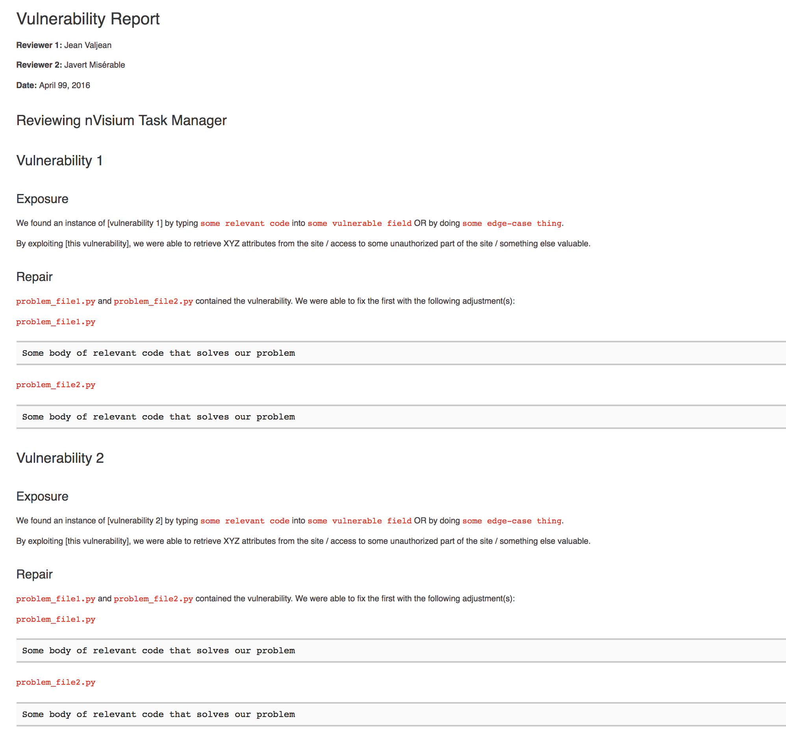

#  Lab 43: OWASP / Security Standards

## Break the site / Fix the site

**This is a Pair assignment**
<!-- short description of project -->
In this series of assignments you will practice identifying various types of vulnerabilities in a website, and then set about fixing them to make the site more secure. The vulnerabilities you will be looking out for will come from the [Open Web App Security Project Top 10 - 2013](https://www.owasp.org/index.php/Top_10_2013-Top_10){:target="_blank"}. The website that you will be breaking is made for exploitation, and will be found [here](https://github.com/nVisium/django.nV){:target="_blank"}. This particular assignment will go through the first four of the top ten.

## Specifications
<!-- Write a spefication for the features required in this lab assignment -->

### Setup
- Fork the django.nV repository linked above, add your partner as a collaborator, and clone **YOUR** fork
- Create a well named branch for today's work

### Features
- Create a markdown file documenting your vulnerability tests called `vulnerability-report.md`.
- Address the following vulnerabilities. **Do not just regurgitate the given solutions!**.
    - A1 - Injection
    - A2 - Broken Auth
    - A3 - XSS
    - A4 - Insecure DOR
- For each of the above vulnerabilities report:
    1. How you found and exploited the vulnerability, including the code/method you used
    1. What you were able to do with the vulnerability (i.e. what was exposed?)
    1. The code that fixes the vulnerability as a markdown code block

*Note: For your vulnerability report, please see the below sample-vulnerability-report. Use the format shown in that document.*
{:target="_blank"}

### Testing
- No testing requirements for this lab.

## Submission
1. Create a pull request from your feature branch to your `master` branch.
2. In your open pull request, leave as a comment [a checklist](https://github.com/blog/1825-task-lists-in-all-markdown-documents){:target="_blank"} of the specifications, with the actual specifications you completed checked off.
3. Copy the link to your open pull request and paste it into the Canvas assignment for this day.
4. Leave any comments you may have about the assignment in the comments box. This includes any difficulties you may have had with the assignment.
5. Merge your feature branch into `master`

## Rubric
- 7pts: Program meets all requirements described in Lab directions.

	Points  | Reasoning | 
	 ------------ | :-----------: | 
	7       | Program runs as expected, no exceptions during execution |
	5       | Program meets all of the  functionality requirements described above (including tests) // Program runs/compiles, Program contains logic/process errors|
	4       | Program meets most of the functionality requirements described above (including tests)  // Program runs/compiles, but throws exceptions during execution |
	3       | Program missing most of the functionality requirements described above // Program runs/compiles |
	2       | Missing Readme Document // Readme Document does not meet standards |
	0       | Program does not compile/run. Build Errors // Required naming conventions not met |
	0       | No Submission |

- 3pts: Code meets industry standards
	- These points are only awardable if you score at minimum a 5/7 on above criteria

	Points  | Reasoning | 
	 ------------ | :-----------: | 
	3       | Code meets Industry Standards // method and variable names are appropriate // Selective and iterative statements are used appropriately, Fundamentals are properly executed // Clearly and cleanly commented // Frequent Commits |
	2       | syntax for naming conventions are not correct (camelCasing and PascalCasing are used appropriately) // slight errors in use of fundamentals // Missing some comments // minimal or no commits |
	1       | Inappropriate naming conventions, and/or inappropriate use of fundamentals // Code is not commented  |
	0       | No Submission or incomplete submission |
